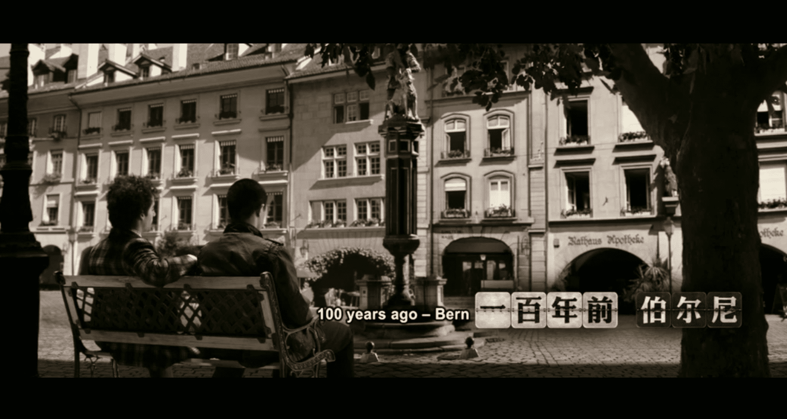
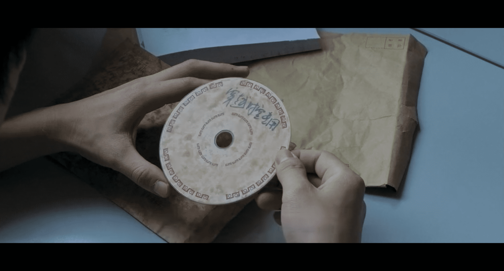
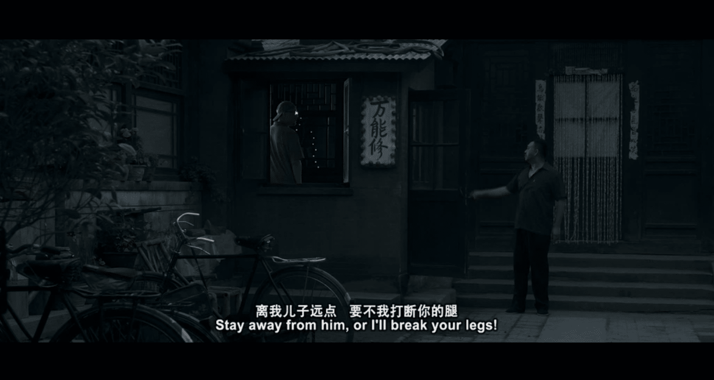
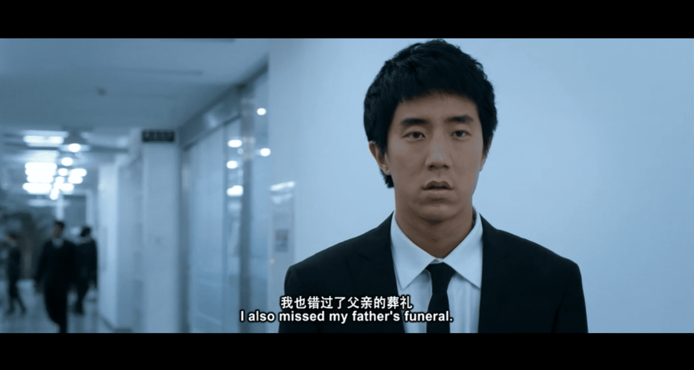
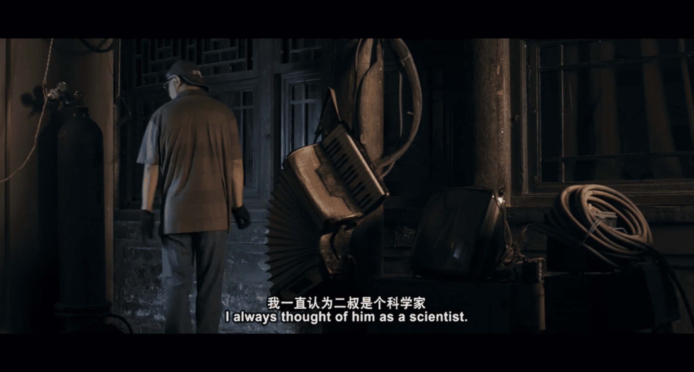
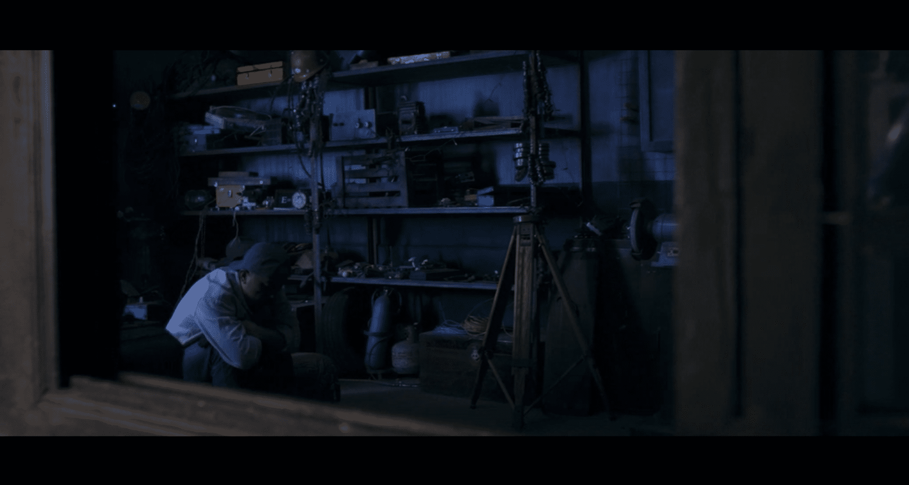

*以下包含对《李献计历险记》的强烈剧透。*

*不过这部电影是2011年上映的，十年前的国产电影了，估计没人会看。但出于道德还是提前声明一下。毕竟声明是作者的事，选择性阅读是读者的事。*

<!--more-->

首先这部电影的名字就起的毫无悬念，“李献计”这个名字就好像“历险记”的谐音一样，毫无意义。外加女主非得给男主加个“献计献策”的外号，不仅长而且尬，男主自己都吐槽了“你不嫌麻烦就行”，女主还是风雨无阻喊了一整部电影，每次听到都起一身鸡皮疙瘩。

当然我不擅长写影评，我也不知道写影评该有哪些套路，但可以说的是，上边写的是欲扬先抑中的抑。

因为电影是2011年上映的，讲述的是2008年的事，所以初看上去整篇电影充满了电子科技产品刚刚在普通百姓家兴起后大街上弥漫的那种非主流气息。

据说电影是漫画改编的，我没去看漫画，也没有多了解。电影里每每到了拍摄有难度的地方，就会变成漫画的形式，比如勇闯索马里海，巧救美国靓妞。

当然不能说是技术达不到，可能只是一种风格，毕竟恐龙时代，工业时代，诺曼底登陆也都去过了，效果还是很真实的，感觉比《巨鳄岛》要真实（没有贬低的意思）。而且电影在叙事风格上也很有特点，并非按时间顺序一成不变。

电影讲述了两个有差时症的人，相亲相爱的故事。差时症名字起的莫名其妙，但设定上就是一种心理疾病，表现为某些时候对时间的感知与常人不同，发病时段不可控。

简单来说，有些时候感觉一秒有一年那么漫长，有些时候两年就跟五分钟一样短。后者会导致发病者产生记忆断片。所以男主女主同病相怜，两个其他人眼中的怪人走在了一起，套路浅白得让我感觉就像我几年前写的小说。

后来喜闻乐见，他俩闹了矛盾，女主一气之下在公路上下车，被大货车撞死。

男主痛苦不已，在没有女主的世界里浑浑噩噩，后来受到二叔的鼓励，开始筹钱打游戏。

…………

**是不是莫名其妙？**可这就是那个电子产品刚刚兴起的时代啊。游戏也不是普通的游戏，打赢了可以穿越时空的。于是几经波折（游戏不是那么好打赢的），男主终于打赢了二叔留下的游戏碟片，成功穿越了时间。但不巧，时间不太准，有时候回到了侏罗纪，和翼龙肩并肩，有时候去了五十年后，坐在楼顶看钢铁森林。

他还到过原始人的洞穴，教他们用打火机取火，也跟爱因斯坦坐在一个长椅上，亲手把质能方程式交在他手中。最终他被诺曼底的一颗炸弹，炸回了中国的五十年代。

很不幸，中国的五十年代没有游戏机，光剩一张碟片也没啥用，所以他就待在了那里，一直待到2008年。干什么呢？当然是救女主啊，在女主下车前一把拦住，微微一笑然后挥袖离去，深藏功与名。

所以套路就是很老啊，不管是当成爱情片还是穿越片，都挺老的。但这位老年男主是游本昌老师演的，演技简直绝了。当时就是因为在知乎看到的这最后一个救女主画面，游老师一个眼神我直接脑补了整个故事，也因此我去看了这整部电影。

有人说整部电影没啥看点，除了最后游老师这个神演技外，没啥特色。我也是这么认为的，说实话电影一开场男主一自白我就已经给电影打低分了。但我今天早上去洗脸的时候，脑袋仿佛突然被一道闪电击过，我突然想通了一个被我忽略的角色——**二叔**。

这个二叔真的只是男主的二叔吗？二叔是男主小时候特别喜欢的一个人，他是一个电器修理工，他什么都会修，他甚至自己造了游戏机；他也什么都懂，**他知道郎平会赢，他知道澳门会在12月20日回归，他知道唐僧会在什么时候遇到妖怪，哪怕他根本没有去看电视，他甚至还懂得穿越时空的道理。**他在男主浑浑噩噩的时候，给了男主一封信，告诉他他可以救回女主，信里附带了一张游戏光碟。

我恍然大悟，这哪里是二叔，这**明明就是男主本人！**

原来他一直生活在小时候的自己身边，难怪小时候的男主会被一种无形的力量吸引到二叔身边。只是可怜男主他爸讨厌他，还要打断他的腿。

要知道男主长大后因为差时症错过了他爸的葬礼，在许多年后，或者说许多年前，还要隐藏身份，生活在老爸身边，每天被老爸威胁着要打断腿，一种不被理解的艰辛突然涌上心头。

男主有一次因为差时症把一年半的时间感觉成了五分钟，电话亭外本来微风徐徐青草萋萋，忽然就飘起了雪。

说实话这一段在后面有男主自白的解释，但如果不是解释，就这么明显的镜头变化我依然没有看出来。五分钟内怎么可能就白雪茫茫，我和男主一样后知后觉。但关于二叔，整个故事都只是暗示，并没有旁白解释他为什么能未卜先知，就好像时空都能穿越了，有几个奇人异士好像也不是问题。但当然不是这么简单，想清楚二叔就是中年的男主后我突然觉得这部电影并没有那么没看点，就好像整个故事在设计上深藏不漏，大智若愚。

关于二叔是中年的男主并非只是猜想，电影中有很多地方可以证明。年轻时男主为了能快速打赢游戏把手换成了机械手，后来就一直戴着黑色手套掩盖，而二叔也自始至终都戴着黑色手套，毫无明示，但处处自明。

而且在最后，二叔在旁白里说了一句话：**我们的时间就像是一个圆，起点同时也是终点，不同的是，你是开始，而我是结束。**

这样回看男主在二叔的这个人生阶段，其实是一个很有悲剧性色彩的时期。二叔从五十年代，经历大炼钢铁、文化革命、改革开放，一直努力活到男主出生，然后在男主身边盖了个修理铺，一直照看男主长大。个人认为这里男主他爸应该是不知道二叔的真实身份的，他忍受着来自自己父亲的恶语相向，和不属于这个时代的孤独感，在男主长大后悄然消失，然后找到那个女主出事的准确时间，成功挽救女主。

所以终其一生啊，也应了男主的那句话，做这一切啊，**都是为了一个女孩**。

当然不能说没有bug。既然二叔存在于男主幼年的时间线，那么在女主出事的那个时空，二叔又去了哪里呢？我暂时还没想明白，可能是一个bug，不过这并不妨碍我非常喜欢二叔的这个角色设置。

我之前也写过一篇小说，讲的就是男主成年后阴差阳错回到过去抚养幼年的自己长大成人的故事。因此我对这部电影产生了新的好感，这也是我写下这篇不知道算什么评论的原因。

所以，有些事情啊，真没有看上去那么简单。